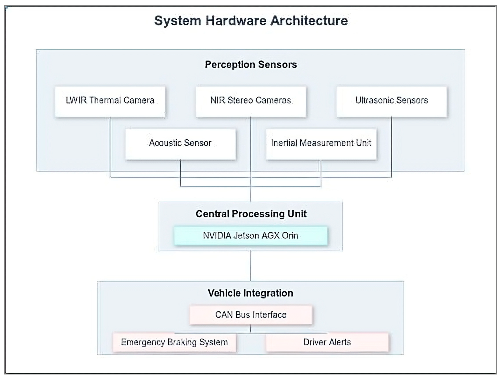
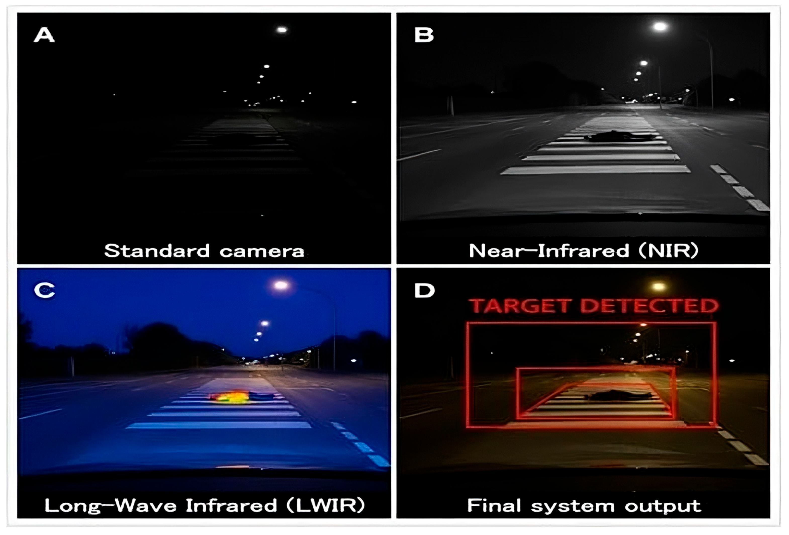
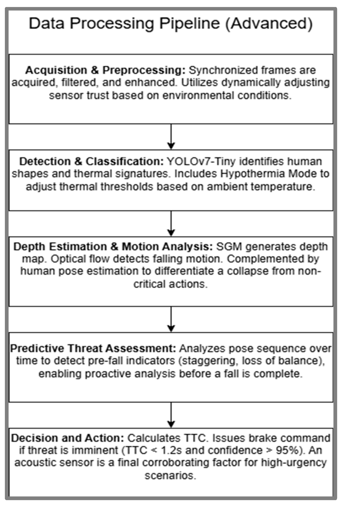
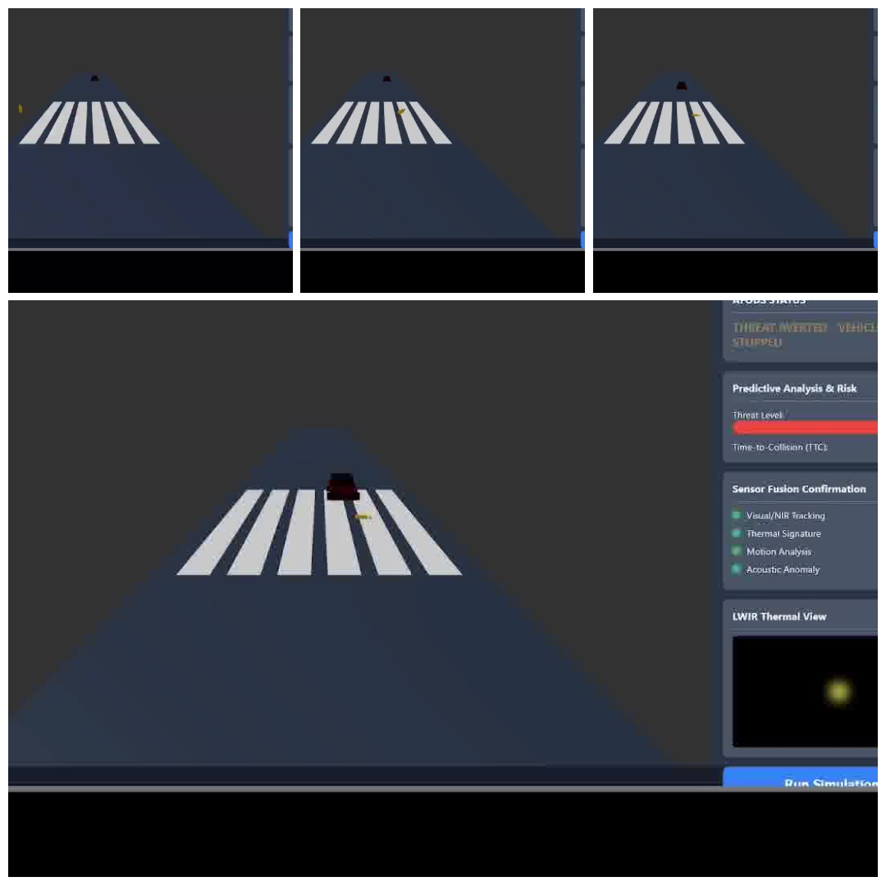
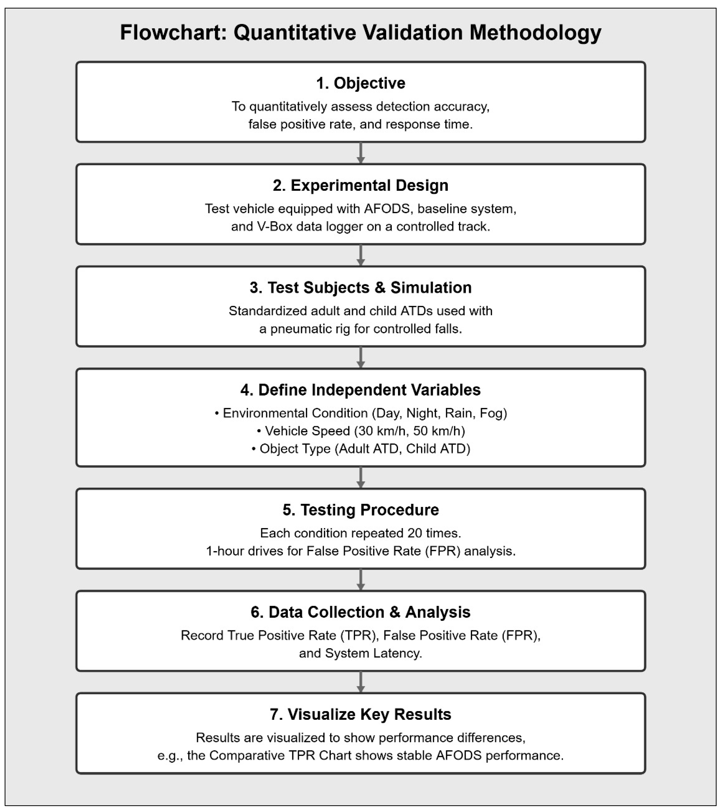
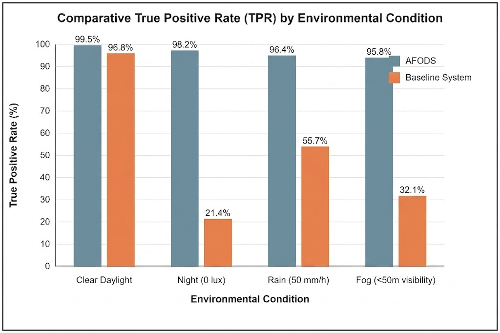

# Advanced Multi-Modal Sensor Fusion System for Detecting Falling Humans

[](https://opensource.org/licenses/Apache-2.0)
[](https://doi.org/10.3390/vehicles7040149)
[](https://doi.org/10.3390/vehicles7040149)
[](https://www.shiga-med.ac.jp/english)
[](https://www.iso.org/standard/43464.html)
[]()
[](https://orcid.org/0000-0003-4641-0112)

> **Authors:** Dr. Nick Barua · Prof. Masahito Hitosugi  
> Department of Legal Medicine, Shiga University of Medical Science, Otsu, Shiga, Japan  
> **Published:** *Vehicles*, Vol. 7, No. 4, p. 149 (2025) · **Part 1 of 4** in the [AFODS Research Program](#-related-publications)  
> **Patent Filed:** Japanese Patent Application No. 2025-167440 (Filed: 3 October 2025)

---

## 📌 Abstract

Collisions with fallen pedestrians pose a lethal challenge to current Advanced Driver Assistance Systems (ADAS). Standard visible-spectrum architectures yield a True Positive Rate (TPR) as low as **21.4% at night (0 lux)** for prone individuals — a critical and life-threatening classification gap.

This repository contains the software framework and quantitative evaluation for the **Advanced Falling Object Detection System (AFODS)**. AFODS architecturally integrates **LWIR Thermal**, **NIR Stereo**, and **Ultrasonic** sensors, processed through a custom AI pipeline combining **YOLOv7-Tiny** for object detection and a **GRU-based RNN** for proactive threat assessment. Validated across 320 controlled trials, AFODS achieved a **99.5% TPR in clear daylight** and a **98.2% TPR at night (0 lux)** — a condition where the baseline system collapsed to 21.4%.

---

## 🖼️ System Overview

### Figure 1 — System Hardware Architecture

*Block diagram showing the flow from perception sensors (LWIR, NIR, Ultrasonic, Acoustic, IMU) through the NVIDIA Jetson AGX Orin central processing unit to the vehicle's CAN bus, emergency braking system, and driver alerts.*

### Figure 2 — Sensor Modality Comparison (Nighttime)

*(A) Standard camera: fallen object nearly invisible at 0 lux. (B) NIR: high-resolution imagery for depth and classification. (C) LWIR: distinct thermal signature of the human body. (D) Final fused system output: TARGET DETECTED.*

### Figure 3 — Data Processing Pipeline

*Five-stage advanced pipeline: Acquisition & Preprocessing → Detection & Classification (YOLOv7-Tiny + Hypothermia Mode) → Depth Estimation & Motion Analysis → Predictive Threat Assessment (GRU/RNN) → Decision & Action (TTC threshold: 1.2 s, confidence threshold: >95%).*

### Figure 4 — Operational Sequence

*Composite image illustrating the three critical phases: (A) Initial state, (B) Predictive detection escalating to CRITICAL threat, (C) Final state — THREAT AVERTED.*

### Figure 5 — Validation Methodology Flowchart

*Seven-stage experimental procedure: Objective → Experimental Design → Test Subjects & Simulation → Independent Variables → Testing Procedure (20 repetitions per condition) → Data Collection → Results Visualisation. Total: 320 trials.*

### Figure 6 — Comparative TPR by Environmental Condition

*AFODS vs. baseline system True Positive Rate across all four environmental conditions. AFODS maintains >95% TPR throughout; the baseline collapses to 21.4% at night and 32.1% in fog.*
> 📝 **Note on Published PDF:** Due to a layout rendering glitch by the publisher in the final printed PDF of the manuscript, the chart axes and numeric labels in the journal's article layout were shifted out of alignment. The underlying experimental data is completely and correctly preserved in **Table 1** of the published paper and is accurately displayed in the corrected chart above.
---

## 📦 Zenodo Data Archives

| Resource | DOI |
| :--- | :--- |
| **Key Figures & Methodology** | [](https://doi.org/10.5281/zenodo.17621800) |
| **Operational Sequence Video** | [](https://doi.org/10.5281/zenodo.17460755) |
| **Archived Source Code** | [](https://doi.org/10.5281/zenodo.18824034) |

---

## 🛠 System Architecture

AFODS is designed to target **ASIL B** compliance under ISO 26262, leveraging redundant sensor modalities to mitigate single-point failures:

- **Spatial Detection:** **YOLOv7-Tiny** trained on 15,000+ images (70/15/15% split) — identifies human shapes and thermal signatures including a dynamic **Hypothermia Detection Mode**
- **Predictive Kinematics:** **GRU-based RNN** analyses pose sequences over a 1–2 s window to identify pre-fall indicators (staggering, loss of balance) before collapse is complete
- **Depth & Motion:** **SGM stereo algorithm** for disparity mapping + **Lucas–Kanade optical flow** for vertical motion tracking + lightweight **human pose estimation**
- **Acoustic Verification:** **MFCC-based classification** (CNN/RNN) distinguishes fall acoustic signatures from ambient road noise — used as a final corroborating factor
- **Processing:** **NVIDIA Jetson AGX Orin** — target pipeline latency under 50 ms
- **Vehicle Integration:** CAN bus interface → emergency braking command + driver alerts

---

## 🧮 Mathematical Logic: Multi-Modal Fusion

### 1. Weighted Detection Probability

The combined detection probability $P_d$ is dynamically adjusted based on environmental conditions (e.g., in heavy rain, LWIR and ultrasonic weights are increased as NIR degrades):

$$P_d = w_{LWIR} \cdot C_{thermal} + w_{NIR} \cdot C_{visual}$$

where $w$ represents the confidence weight and $C$ represents the classifier's confidence score.

### 2. Time-to-Collision

The braking decision is triggered when TTC < 1.2 s with detection confidence > 95%:

$$TTC = \frac{D}{v_{vehicle}}$$

where $D$ is the depth to the object from the SGM algorithm (m) and $v_{vehicle}$ is host vehicle speed (m/s).

### 3. Fall Velocity Estimation

Using NIR stereo disparity, the system calculates vertical velocity ($V_z$) to distinguish a fall from standard pedestrian motion:

$$V_z = \frac{\Delta d}{\Delta t} \cdot \frac{B \cdot f}{Z^2}$$

where $B$ is the stereo baseline (25 cm) and $f$ is the focal length of the NIR stereo pair.

---

## 📊 Validated Performance (320 Controlled Trials)

All metrics are drawn directly from the peer-reviewed publication (Tables 1 & 2). The validation used standardised adult and child ATDs (50th percentile male; 6-year-old child) deployed via pneumatic rig at 20 m, tested at 30 and 50 km/h. Each condition was repeated 20 times.

### Detection Accuracy (True Positive Rate)

| Environmental Condition | AFODS TPR (%) | Baseline TPR (%) | p-value |
| :--- | :---: | :---: | :---: |
| **Clear Daylight** | **99.5** | 96.8 | 0.041 |
| **Night (0 lux)** | **98.2** | 21.4 | <0.001 |
| **Rain (50 mm/h)** | **96.4** | 55.7 | <0.001 |
| **Fog (<50 m visibility)** | **95.8** | 32.1 | <0.001 |

### False Positive Rate & System Latency

| System | Condition | False Positives (per 24 h) | Reduction vs. Baseline |
| :--- | :--- | :---: | :---: |
| Baseline | Daytime | 16.4 | — |
| Baseline | Nighttime | 31.2 | — |
| Baseline | Adverse Weather | 48.9 | — |
| **AFODS** | **Daytime** | **1.1** | **93.3%** |
| **AFODS** | **Nighttime** | **1.5** | **95.2%** |
| **AFODS** | **Adverse Weather** | **2.3** | **95.3%** |
| **AFODS** | **Average** | **1.6** | **95.0%** |

**Mean System Latency:** 46.3 ms (SD = 4.1 ms) across all 320 trials  
**Mean Detection Range:** AFODS 41.5 m (SD = 4.8 m) vs. Baseline 22.3 m (SD = 12.5 m) — *t*(158) = 15.72, *p* < 0.001

---

## ⚖️ Functional Safety (ISO 26262)

AFODS targets **ASIL B** compliance. The hazard classification for the detection of fallen pedestrians is:

- **Severity (S3):** Life-threatening or fatal injuries
- **Exposure (E3):** Significant occurrence in urban and nighttime environments
- **Controllability (C0):** Near-zero ability for a driver to avoid the hazard once within the detection gap

The decision logic requires corroboration between thermal signatures, visual object classification, and motion analysis before any braking action is triggered, directly addressing ISO 26262 requirements for fault tolerance and system reliability. ANOVA confirmed that environmental condition had minimal effect on AFODS performance (F(3,156) = 2.8, p = 0.042) versus a highly significant effect on the baseline (F(3,156) = 112.4, p < 0.001).

---

## 🔗 Related Publications

This repository is **Part 1** of a unified 4-paper road safety research program:

| # | Title | Venue | Role |
| :---: | :--- | :---: | :--- |
| **1** | **Advanced Multi-Modal Sensor Fusion System** *(this repo)* | MDPI Vehicles | Technical foundation & benchmarks |
| 2 | [From Post-Mortem to Prevention: Redefining "Invisible" Pedestrians through ISO 26262 and Multi-Modal AI](https://doi.org/10.2139/ssrn.6305618) | SSRN | Problem framing & ISO 26262 compliance |
| 3 | [Integrated Safety Architectures: Leveraging Multi-Modal AI and ISO 26262 to Protect Vulnerable Road Users](https://ssrn.com/abstract=6112086) | SSRN | System-level VRU architecture |
| 4 | Sudden Incapacitation or Death at the Wheel: Unravelling the Predictors of Catastrophic Multi-Vehicle Collisions | SSRN *(pending)* | Epidemiological evidence for ADAS mandate |

---

## 📂 Related Repositories

- **[AFODS-Sensor-Fusion-Code](https://github.com/Nick-Barua/AFODS-Sensor-Fusion-Code)** — YOLOv7 and GRU model scripts
- **[AFODS-Operational-Sequence](https://github.com/Nick-Barua/AFODS-Operational-Sequence)** — Five-stage pipeline diagrams and graphical abstract
- **[From-Post-Mortem-to-Prevention-AFODS](https://github.com/Nick-Barua/From-Post-Mortem-to-Prevention-AFODS)** — ISO 26262-aligned conceptual framework
- **[Leveraging-Multi-Modal-AI-and-ISO-26262-to-Protect-Vulnerable-Road-Users](https://github.com/Nick-Barua/Leveraging-Multi-Modal-AI-and-ISO-26262-to-Protect-Vulnerable-Road-Users)** — Safety framework

---

## 📝 Citation

```bibtex
@article{vehicles7040149,
  author    = {Barua, Nick and Hitosugi, Masahito},
  title     = {Advanced Multi-Modal Sensor Fusion System for Detecting Falling Humans:
               Quantitative Evaluation for Enhanced Vehicle Safety},
  journal   = {Vehicles},
  volume    = {7},
  number    = {4},
  pages     = {149},
  year      = {2025},
  doi       = {10.3390/vehicles7040149},
  url       = {https://doi.org/10.3390/vehicles7040149}
}
```

---

## 📜 License

This project is licensed under the **Apache 2.0 License** — see the [LICENSE](LICENSE) file for details.

The system described in this repository is subject to **Japanese Patent Application No. 2025-167440** (Filed: 3 October 2025).
